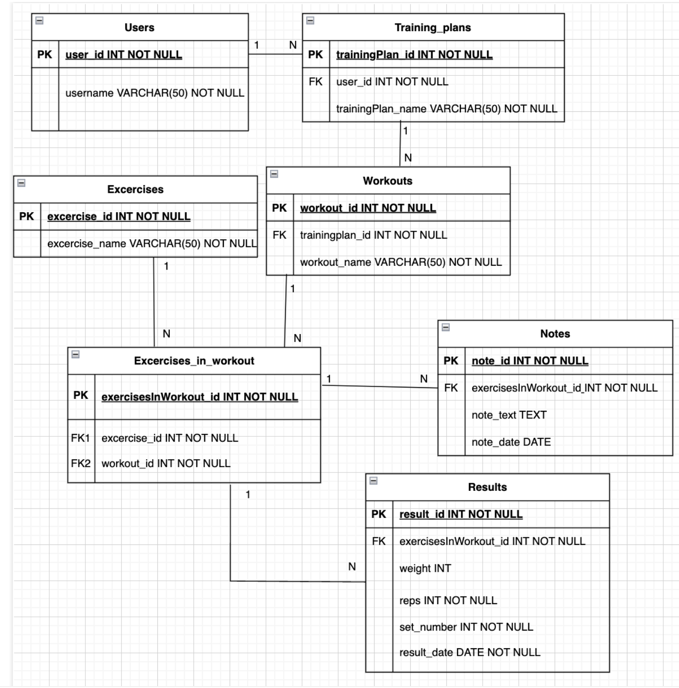

This database project was created in the "Basics of Database Systems" course. SQLite was used as the relational database management system in this course project.

I created a relational database for my course project to help users record, track, and analyze their training progress. It provides a structured way to store training plans, related exercises, results, and notes about workouts. The database allows users to design structured training programs, record detailed performance metrics (such as weights, reps, and sets), and track progress over time. The course project documentation can be found in the PDF file.

I created the following queries to retrieve relevant information for the database user:
1) List all training plans and their associated workouts for a specific user.
2) List all exercises included in a specific workout for a specific user.
3) List all comments added to a specific workout.
4) List all recorded results for a specific exercise by a specific user, ordered chronologically.
5) List the best recorded performance for each exercise for a specific user.

To optimize query performance, the following indexes have been implemented:
index_results_exercisesInWorkout: Speeds up searches for exercise results.
index_exercisesInWorkout: Optimizes lookups of exercises within workouts.
      
